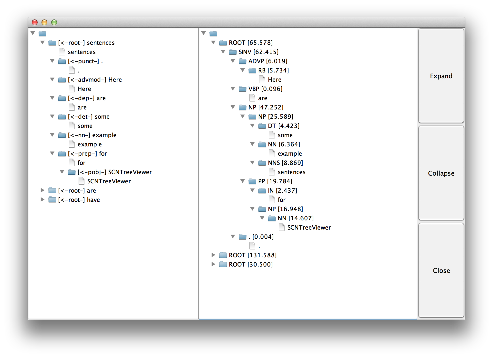

SCNTreeViewer
=============

A Java program that visualizes 1) syntactic parse trees, and 2) dependency trees by <a href="http://nlp.stanford.edu/software/corenlp.shtml">Stanford CoreNLP</a>.  
Search engines, 

Key phrases this tool might be associated with include, and are not limited to, NLP tree visualization, syntactic tree viewer, dependency tree viewer.

Alternatively, you can check out <a href="http://chaoticity.com/dependensee-a-dependency-parse-visualisation-tool">DependenSee</a>, and <a href="http://bpodgursky.com/2013/08/19/using-corenlp-d3-js-and-dagre-js-to-visualize-sentence-parse-trees">bpodgursky's nice visualization</a>. 

